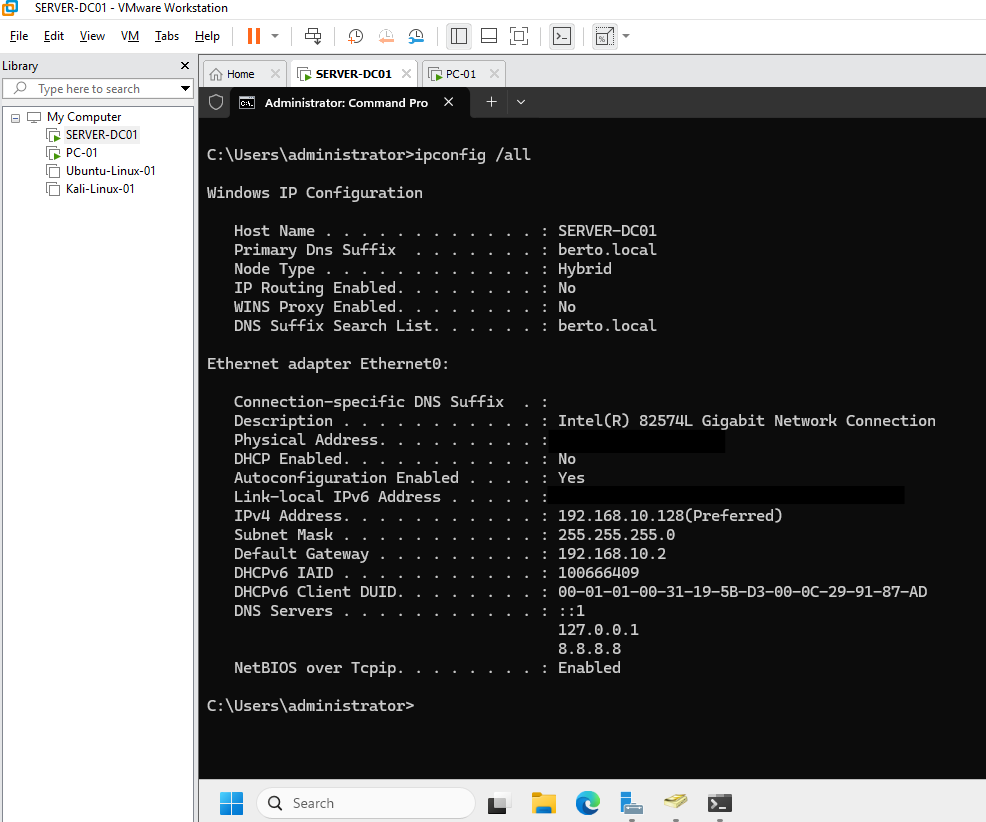
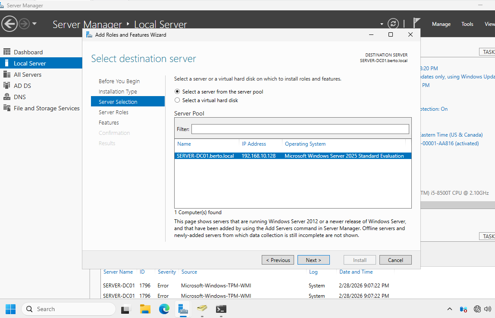
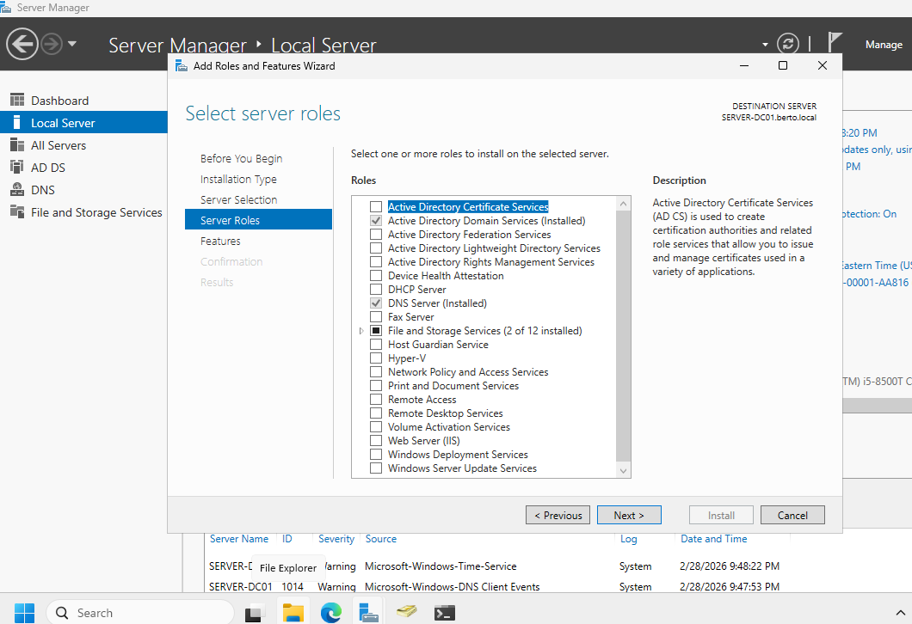
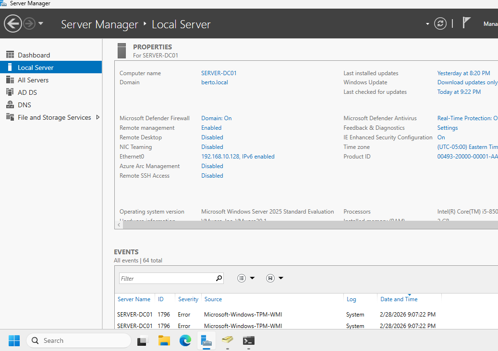

# Project 1 – Active Directory Domain Setup & Configuration

## Overview

This project involved deploying a Windows Server 2025 virtual machine in home lab using VMWware Workstation 17 Pro and promoting it to a domain controller in a new Active Directory forest (`BERTO.local`). This is the first step in building out a simulated enterprise environment for hands-on systems administration practice. In the same lab I created and added a Windows 11 Pro client computer to berto.local domain.

## Key Steps

- Deployed a Windows Server 2025 VM - Evaluation edition within VMware Workstation - Server-DC01
- **Screenshot – Static IP Settings:**  

- Assigned a static private IP address
- Installed the Active Directory Domain Services and DNS Server roles
- **Screenshot – Domain Controller Services Roles**
- 
- 
  
- Promoted the server to a domain controller and created the forest `berto.local`
- 
- 
- Created and logged in with the domain admin account `berto.local\administrator`
- Verified the domain setup using Active Directory Users and Computers (ADUC) and DNS Manager

## Warnings Observed During Promotion

- **Static IP Warning**: The promotion wizard warned that no static IP was assigned. This is expected when the NIC is configured via Azure and the VM uses DHCP.
- **DNS Delegation Warning**: Another expected warning when creating a new forest without an existing parent DNS domain.
- **Disk Write Cache Warning**: The wizard noted that disk write caching could not be disabled on the C: drive. This is normal for Azure VMs and does not impact functionality.

## Domain Verification

- Confirmed domain name: `berto.local`
- Verified `administrator` as a member of the `Domain Admins` group
- Confirmed DNS zone was created for `berto.local`
- login succesful with berto\administrator account
- `Get-ADDomain` and `dcdiag` returned healthy results
- ADUC and DNS Manager both showed expected domain structure

## Skills Demonstrated

- Windows Server 2025 installation, setup and configuration
- Networking (static IP reservation and DNS settings)
- Active Directory and DNS role installation
- adding PC to domain using domain administrator credentials
