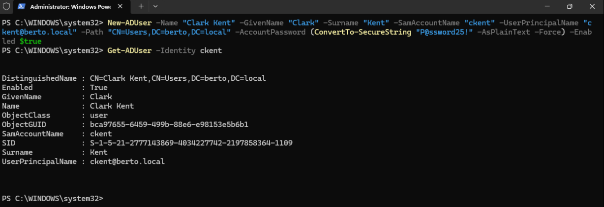
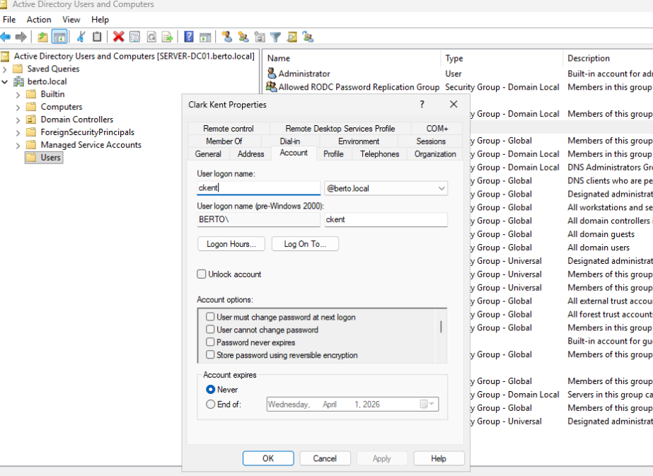

# Project 2 – Active Directory User and Group Management

## Overview

This project involved creating AD users and groups, modifying different attributes of AD users and AD groups in a home lab using Windows ADUC and Powershell script within domain called "BERTO.local".

## Created Single/Multiple end users
User creation - Clark Kent
- **Screenshot – Single user creation using powershell script**
    
- 
  
- 

## User Creation - Bulk addition

- 
  
 
- Created and logged in with the domain admin account `berto.local\administrator`
- Verified the domain setup using Active Directory Users and Computers (ADUC) and DNS Manager

## Skills Demonstrated

- OU design for scalable AD structure
- User account provisioning in Active Directory
- Security group creation and access modeling
- GUI-based AD administration using ADUC
- PowerShell verification of AD group membership
