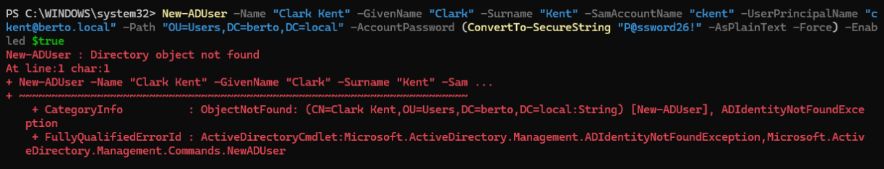
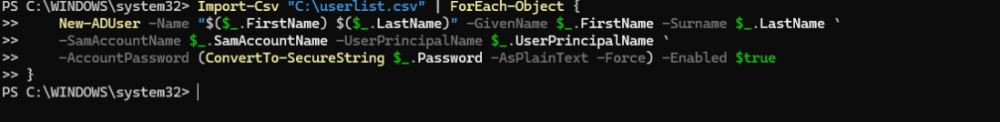
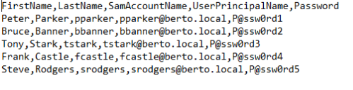
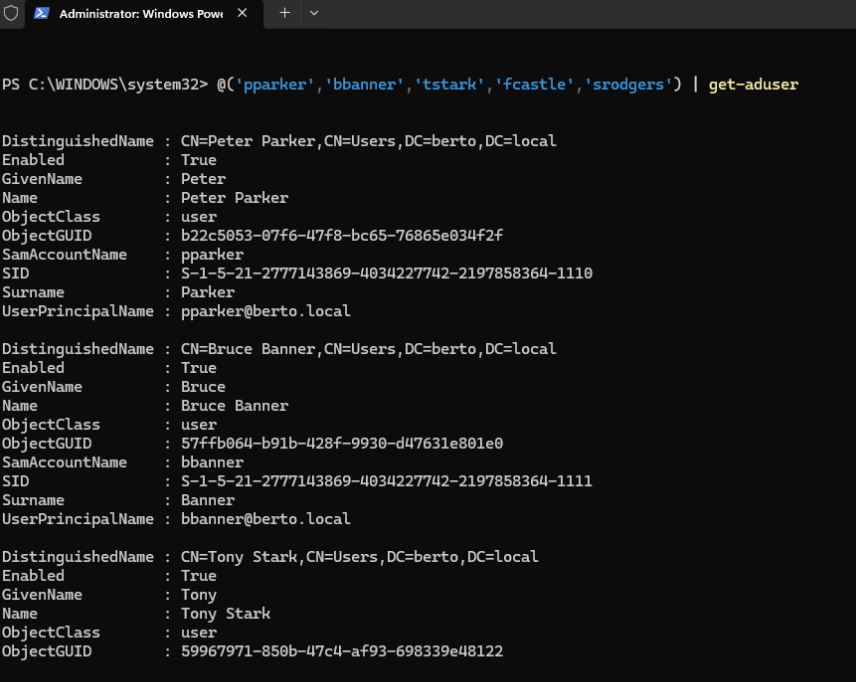
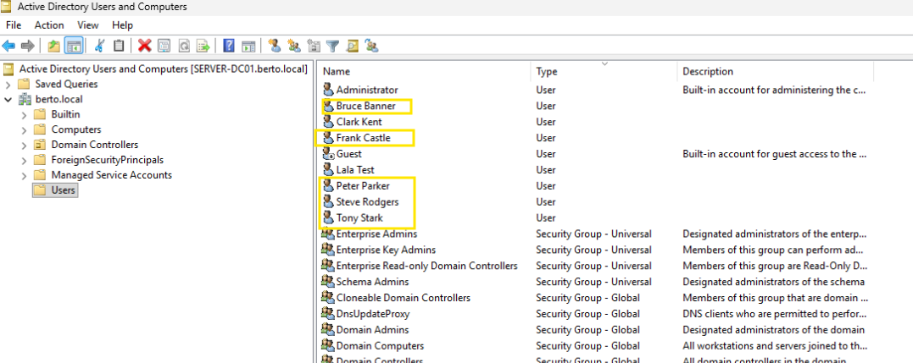

# Project 2 – Active Directory User and Group Management

## Overview

This project involved creating AD users and groups, modifying different attributes of AD users and AD groups in a home lab using Windows ADUC and Powershell script within domain called "BERTO.local".

## Step 1 - Created Single/Multiple end users
User creation - Clark Kent
- Single user creation using powershell script**
    
- 
  
- 

## Encountered Powershell ERROR / Resolution

Ran powershell script and ERROR came up - after error checking and troubleshooting - Error stemmed from wrong input of OU (Org Unit) designation instead of CN (Common Name) as per domain ADUC structure within the powershell script.

- 
  

## Step2 - User Creation - Bulk addition

Ran powershell script to create bulk users from a csv file which included several attributes.

- 
- 

- Verified bulk users were created by a poweshell check and ADUC structure.
  
- 
- 
  

## Step 3 - AD Group creation and User assignment

## Skills Demonstrated

- OU design for scalable AD structure
- User account provisioning in Active Directory
- Security group creation and access modeling
- GUI-based AD administration using ADUC
- PowerShell verification of AD group membership
